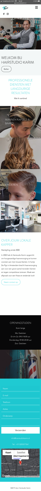
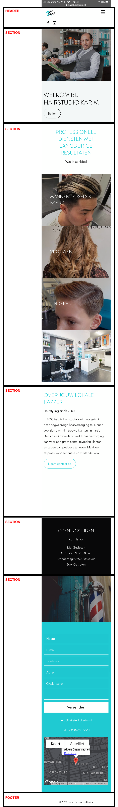

# Procesverslag: Keanu Westerman

Link: https://keanuwesterman.github.io/frontend/

Markdown cheat cheet: [Hulp bij het schrijven van Markdown](https://github.com/adam-p/markdown-here/wiki/Markdown-Cheatsheet). Nb. de standaardstructuur en de spartaanse opmaak zijn helemaal prima. Het gaat om de inhoud van je procesverslag. Besteedt de tijd voor pracht en praal aan je website.

## Bronnenlijst
1. https://www.w3schools.com/css/tryit.asp?filename=trycss_forms
2. https://www.w3schools.com/html/tryit.asp?filename=tryhtml_table

<!-- bronnen voor responsive nav -->
3. https://www.youtube.com/watch?v=XZsuI5wyRzs
4. https://www.bootstrapcdn.com/fontawesome/
5. https://fontawesome.com/icons/bars?style=solid 

6. https://partyflock.nl/location/21289:HairStudio-Karim

## Eindgesprek (week 7/8)

-dit ging goed & dit was lastig-

**Screenshot(s):**

-screenshot(s) van je eindresultaat-

## Voortgang 3 (week 6)

Wat ging goed?

Voortgangsgesprek met Danny was heel chil. Ik dacht dat ik achterliep maar dat viel nog mee. 
In deze week niet heeeel veel kunnen doen door andere vakken en werk. Heb een detailpagina maar moet dat nog wel verder uitwerken. Verder wil ik graag toegankelijkheid zo goed mogelijk maken, dus denken aan contrast, alt-tekst en kijken of ik animaties aan/uit kan laten zetten. En wil ik een animatie voor als je een afspraak wil maken, dat er dan een pop-up op het scherm komt waar je je afspraak kan maken. Ook moet ik nog flink bezig responsiveness. Nog ff flink aan de slag in de vakantie in ieder geval. 

### Agenda voor meeting
Vragen: 

- Een toggle inplementeren voor de button (show less)
- Toegankelijkheid verhogen > hoe zet je animaties aan/uit 
- extra animatie voor pop-up bij afspraak maken
- responsivess evt tips?

(Firza)
-Button niet klikbaar; kom dit door overlappende divs en/of z-indexes?
-Een toggle inplementeren voor de button (show less)
- evt. Javascript nachecken

<!--  -->

## Voortgang 2 (week 5)

Wat ging goed? 
- Voor mijn gevoel loop ik een beetje achter maar ik denk dat ik dat nog wel kan inhalen.  Ik was nog niet zeker van de keuze van surface plane of responsive maar ik kies nu in ieder geval voor responsive. Daarnaast heb ik mijn hamburgermenu kunnen maken met een animatie, dus dat was wel positief. Ook is mijn homepagina bijna klaar. 

### Agenda voor meeting
Vragen: 

- Waarom sommige afbeeldingen wel in de readme in github komen te staan en de andere niet?
- wit-ruimte achter de legend van mijn formulier 
- hoe implementeer ik een kaart in mijn website
- is het beter/netter om een formulier op een andere pagina te zetten?
- Zelf nog even uitzoeken hoe media Queries werken 
- Waarom mijn nav op de ene pagina goede grootte heeft en op alle andere 3 niet?

(Firza)
- Code weer nachecken op semantisch correctheid
- Onderdelen centreren
- Het (overbodig) gebruik van mediaqueries
- Dropdown/show more button voor de news section

### Verslag van meeting
Gezamenlijk gekeken naar hoe je de images moet benoemen hoe je ze in github zichtbaar kan maken. Het is belangrijk te letten op hoe het precies moet worden geschreven met welke elementen () ,{}, !. De wit-ruimte die achter mijn formulier zit, is hoogstwaarschijnlijk op te lossen door de volgorde te veranderen naar form > fieldset > legend (ipv fieldset legend form). Ook hebben we behandeld hoe je een kaart van Google op de website neer zet , met iframe. De specificaties kan je dan in html nog aanpassen heights/width. 
Waarom mijn nav niet hetzelfde was , kwam door de meta=viewport. Deze had ik wel op de homepagina staan maar niet op de andere pagina's. 

<!--  -->

## Voortgang 1 (week 3)

### Stand van zaken

Wat ging goed?
- Voor mijn gevoel maak ik wel stappen in het begrijpen van code. Ik snap vaker waar de problemen liggen, ook al zijn dit soms stomweg komma's vergeten. Wat ik vooral chil vind is dat ik voorheen coderen echt vreselijk vond. Maar het steeds en steeds leuker begin te vinden. 

- Ik merk dat ik nog wel echt stappen kan maken op gebied van positioneren, responsiveness en eigenlijk heel veel dingen nog... 
Zoals ik in Week 3 ook al zei wil ik te veel tegelijk doen waardoor ik de draad soms kwijt raak. Hierdoor raak ik in de war en kan dan niet snel de oorzaak vinden van waar het probleem lag. Ook op het internet kijken helpt voor mijn gevoel niet. Vaak krijg je code die dan opzich zelf prima werken, maar als je zelf dan je eigen code bij gaat schrijven, gaat alles schots en scheef staan.

!(/images/voortgang1.png)

### Agenda voor meeting

- Divjes/classes/ID
- Hoeveel mag het gebruikt worden (semantiek)
- Scale 
- Formulier 
- Drop-down (JS)
- Flex-box
- Waarom sommige afbeeldingen wel in de readme in github komen te staan en de andere niet?

### Verslag van meeting

- nog uitzoeken wat mijn animatie zou zijn naast hamburger menu > wellicht een pop-up wanneer iemand een afspraak wil boeken
- met padding en % + em's spelen om positioneringen wat beter te krijgen

## Intake

WEEK 1

**Je startniveau:** Blauw/Rood 

**Je focus:** Surface plane

**Je opdracht:** -link naar de website die je gaat namaken óf de naam van je eigen ontwerp-

**Screenshot(s):** https://www.hairstudiokarim.nl/

- Waarom deze website?

Waarom ik deze website gekozen is omdat ik de vorige keer bij deze kapper in de zaak was. Karim, de kapper, vertelde dat hij ontevreden was over zijn website en ik vertelde dat ik dit blok Front End zou gaan volgen. Het lijkt mij leuk om deze website te verbeteren omdat ik hem er ook mee kan helpen. 

- Uitdagingen

Ik ben zelf geen ster in coderen dus bij mij liggen de uitdagingen vrijwel overal. Vorig jaar heb ik bij Internetstandaarden geprobeerd mijn portfolio-website responsive te maken maar deze bleef haken bij 960px. Naast een responsive website krijgen, wil ik beter worden in het maken van een mooi formulier. In weze wil ik vooral stappen maken om een mooie surface laag neer te zetten die representatief is voor een professionele website. 

**Breakdown-schets(en):**

 (basiswebsite/images/gedetailleerd.png)

In deze week heb ik een website uitgekozen. De HTML-code heb ik in de index gezet en morgen zullen we in de les aan de slag gaan met CSS om de website vorm te geven. 

WEEK 2 

-  Positionering proberen toe te passen op sommige afbeeldingen 
- les van Flex-box gemist. Dit proberen in te halen en toe te passen op eigen website

Bij het positioneren van tekst op de afbeeldingen heb ik geprobeerd met Z-index de h3's binnen deze afbeeldingen te krijgen. Dit ging niet heel makkelijk. De tekst nam positie aan op de verkeerde plek (onder de juiste afbeelding)

WEEK 5

- Deze week begonnen met JavaScript. Binnen de opdrachten snap ik het wel (Codepen) maar toen ik dit probeerde te implementeren in mijn eigen website lukte dit niet. De bedoeling was door op een knop te drukken, twee elementen bij elkaar te laten komen met "ease-in". Alleen dat lukte niet. 
- Ook merk ik dat ik het meeste moeite heb met het css'en en stap voor stapsgewijs, op een logische manier te werk gaan. Ik doe steeds dingen door elkaar heen. Dan weer proberen responsive te maken, dan weer bezig zijn met een formulier en dan weer een beetje Javascript proberen. Zo maak ik nu pas een begin met de 2e pagina voor de eindopdracht. Ik ga vanaf nu proberen stap voor stap te werken ipv ongestructureerd. 

Week 4 
- Na het voortgangsgesprek merkte ik dat ik nog lang niet zo ver ben als de andere. Ik heb moeite met positionering. 

Ik had mijn website eerst op mobile first voor het eerste voortgangs gesprek gedaan en daarna op website grootte. Dit was niet helemaal bedoeling, dus dat weer terug verandert. 

Ik wil nu graag zorgen dat mijn hoofdpagina in ieder geval responsive wordt + de form uitgewerkt. 

Voor mijn formulier gebruik ik fieldset. Een van de childs van deze fieldset = legend en deze valt een beetje raar op mn formulier. Er zit een wit randje er op. Ook had ik de vraag of ik niet beter een contact formulier op een andere pagina kan doen. 

Wat wel goed ging is het maken van mijn hamburger menu met een animatie er bij. Eerst heb ik divjes gebruikt voor in mn index.html. Vervolgens heb ik met flex-box gespeeld en er voor gezorgd dat mijn header nav ul verticaal buiten het beeld zou staan. Dit heb ik gedaan door right:-100px te doen.  Nu kon ik met Javascript de burger en de nav selecteren, deze laten luisteren naar de click om mijn nav te laten verschijnen (door middel van de .hbactive terug te schuiven van right -100 naar right 0. Daarna heb ik in mijn css 3 toggles toegevoegd aan het hamburger menu zodat dit kruisje animeert op moment dat ik erop klik. 

WEEK 5 

Wat ging goed? 
- Voor mijn gevoel loop ik een beetje achter maar ik denk dat ik dat nog wel kan inhalen.  Ik was nog niet zeker van de keuze van surface plane of responsive maar ik kies nu in ieder geval voor responsive. Daarnaast heb ik mijn hamburgermenu kunnen maken met een animatie, dus dat was wel positief. Ook is mijn homepagina bijna klaar. 

### Agenda voor meeting
Vragen: 

- Waarom sommige afbeeldingen wel in de readme in github komen te staan en de andere niet?
- wit-ruimte achter de legend van mijn formulier 
- hoe implementeer ik een kaart in mijn website
- is het beter/netter om een formulier op een andere pagina te zetten?
- Zelf nog even uitzoeken hoe media Queries werken 
- Waarom mijn nav op de ene pagina goede grootte heeft en op alle andere 3 niet?

(Firza)
- Code weer nachecken op semantisch correctheid
- Onderdelen centreren
- Het (overbodig) gebruik van mediaqueries
- Dropdown/show more button voor de news section

### Verslag van meeting
Gezamenlijk gekeken naar hoe je de images moet benoemen hoe je ze in github zichtbaar kan maken. Het is belangrijk te letten op hoe het precies moet worden geschreven met welke elementen () ,{}, !. De wit-ruimte die achter mijn formulier zit, is hoogstwaarschijnlijk op te lossen door de volgorde te veranderen naar form > fieldset > legend (ipv fieldset legend form). Ook hebben we behandeld hoe je een kaart van Google op de website neer zet , met iframe. De specificaties kan je dan in html nog aanpassen heights/width. 
Waarom mijn nav niet hetzelfde was , kwam door de meta=viewport. Deze had ik wel op de homepagina staan maar niet op de andere pagina's. 

WEEK 6 

Nadenken over toegankelijkheid. Wil graag de mogelijkheid implementeren om animaties aan/uit te zetten. Ook kijken naar contrast & alt-teksten. Voor de rest verder met detail-pagina en hopelijk nog een micro-interactie fixen bij het maken van een afspraak. 
